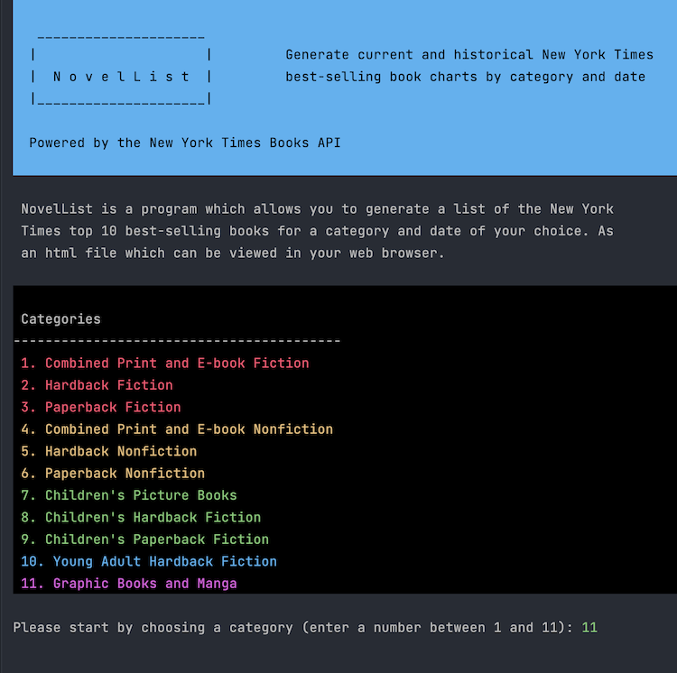
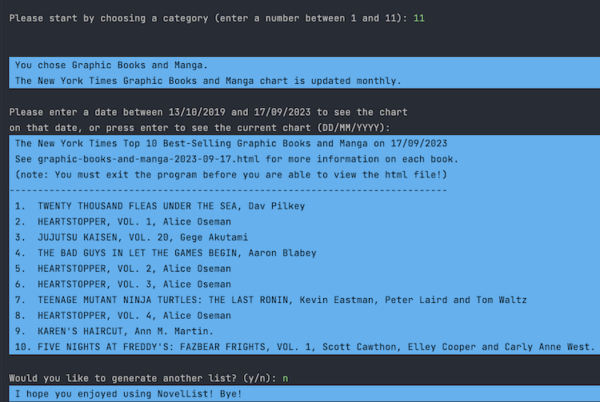
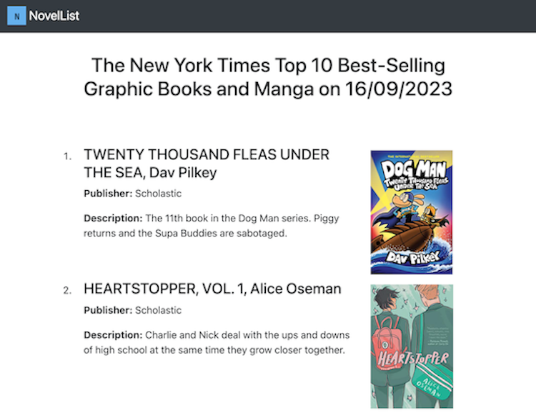

# NovelList
 

NovelList is a Python console application which utilizes the **New York Times Books API** to allow the user to generate current and historic top 10 best-selling book charts for a range of categories (fiction, nonfiction, children's books, etc.).  

As well as being displayed in the console, the results of the user's request are written to an html file which contains further detail (publisher, description) and images of the books. The content of the html file is created using the **Jinja2** templating engine which can be installed using the command *pip install Jinja2*. Please note that the program must be ended before the html file can be viewed.

To use the application, it is necessary to obtain an API key - instructions on how to do this are included in the main.py file.  

To display colored text and backgrounds in the console, it is necessary to install the **Colorama** library. This can be done by running the command *pip install colorama*.

### Screenshots of the app

### Screenshot of sample html file output as displayed in web browser

